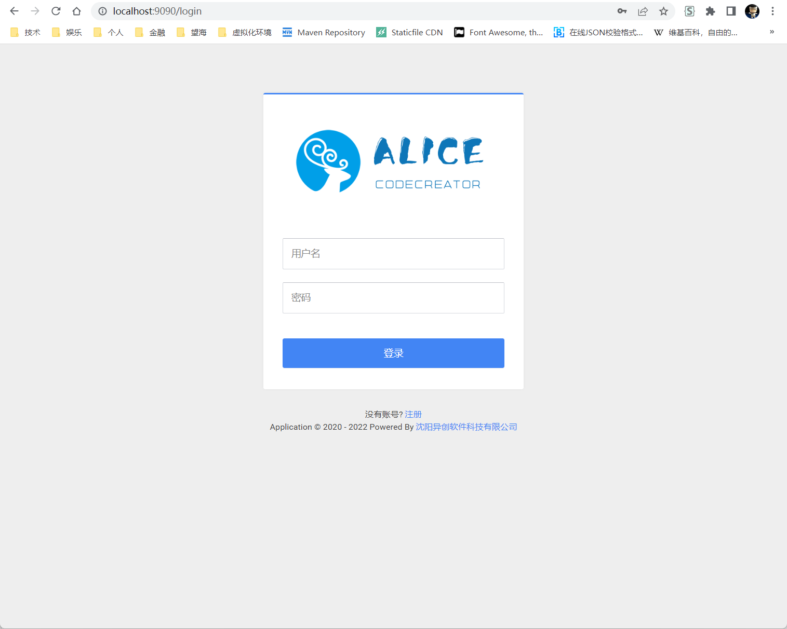

# 快速开始
---

[TOC]

## Alice CodeCreator能做什么？
Alice CodeCreator是一个通用代码生成辅助工具，它可以帮助你从数据库表结构直接生成代码，包括不限于html、js、java、xml、sql等各种类型代码。

## 环境要求

Alice CodeCreator 是一个Java工程，数据库使用了MySQL，运行它需要有一定的基础环境。

### 安装数据库
安装MySQL数据库。如本机已有MySQL数据库，此步骤可跳过。

!!! tip 
    MySQL数据库版本号>=5.7。

### 安装JDK
安装Java虚拟机。如本机已有JDK，此步骤可跳过。

!!! tip 
    JDK版本号>=1.8。

## 安装与运行

### 下载程序
访问发布地址：[https://github.com/lxp135/alice-code-creator/releases](https://github.com/lxp135/alice-code-creator/releases)
下载最新版本程序，如下图所示：

### 创建数据库
使用SQL脚本`alice_code_creator.sql`创建Alice CodeCreator自身库。

### 修改配置文件

打开`application-dev.yml`配置文件，修改你想使用的端口号，默认为9090。修改数据库地址为你自己的地址。如下图所示：

### 运行
打开命令行，执行`java -jar alice-code-creator.jar`启动程序，如下图所示：

执行成功后，如下图所示：

打开浏览器，访问`http://localhost:9090`，显示登录界面，如下图所示：

!!! tip 
    如果修改配置文件时，修改过启动端口，这里不使用`9090`而使用你自己修改的端口号。
    
默认登录账号为`liuxp`，密码为`123456`。