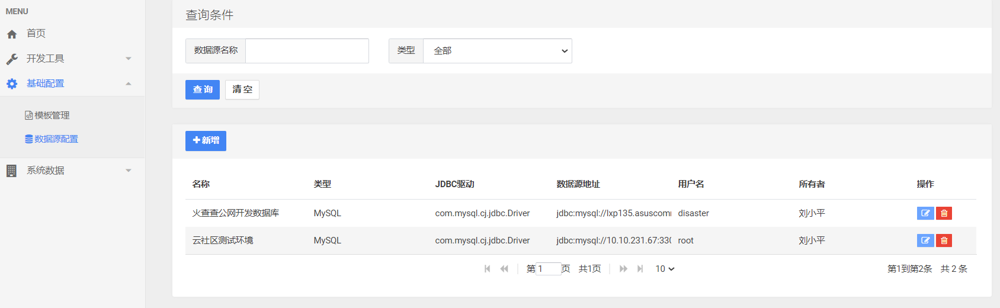
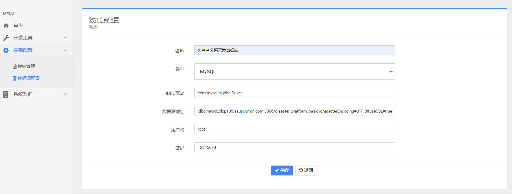
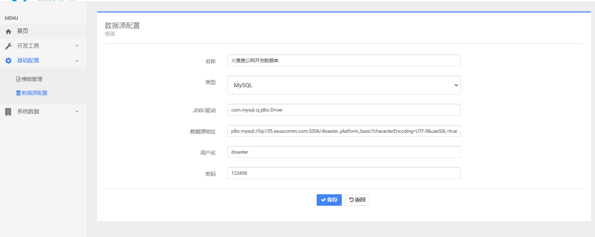
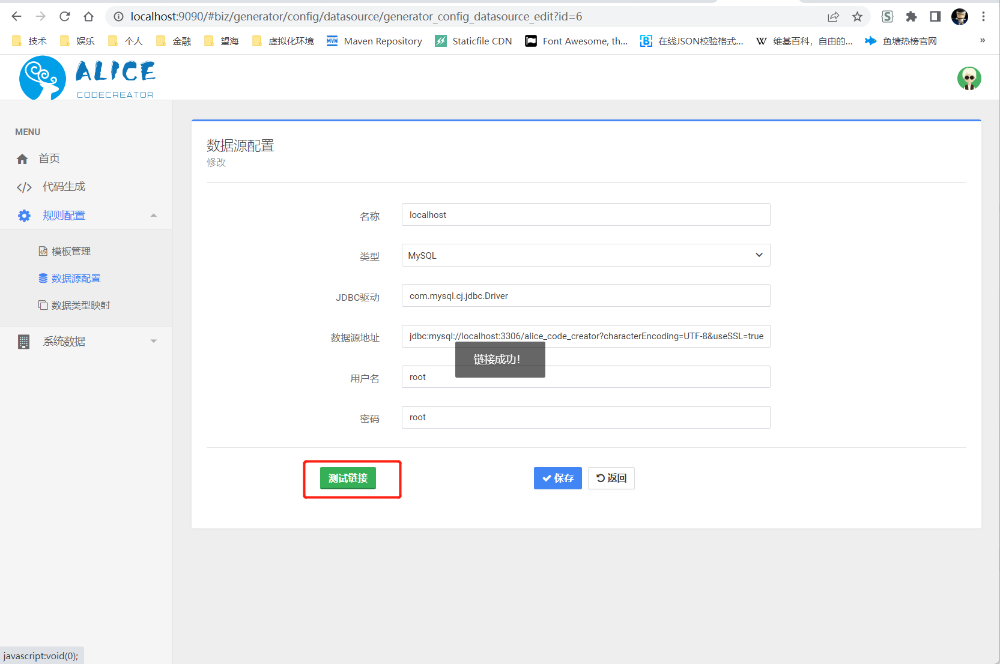
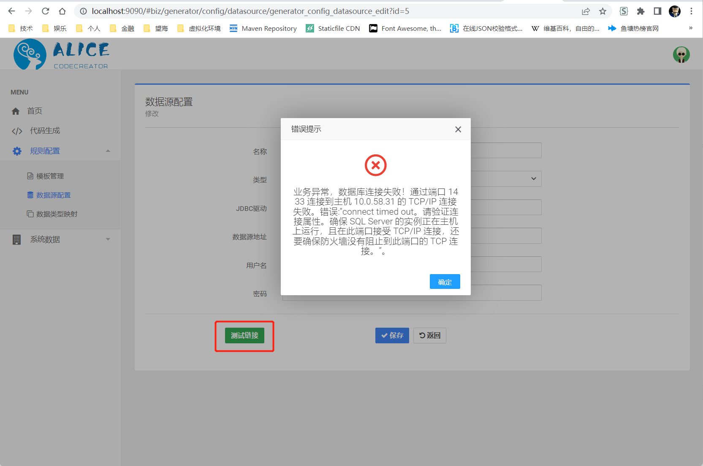
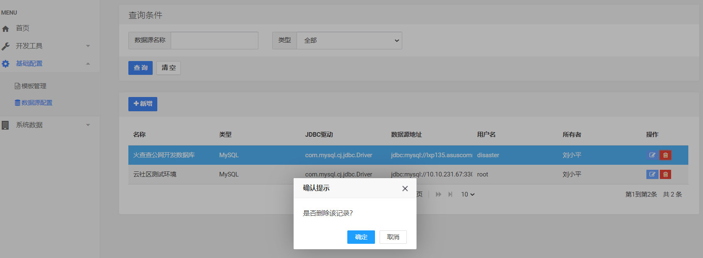

# 数据源配置
---

[TOC]

这篇指南文档将教会你如何配置数据源。

## 数据源列表

打开菜单“规则配置”中的“数据源配置”页面，如下图：

可以看到已经配置的数据源，数据源是基于用户做权限隔离的，每个注册用户只能看到自己的数据源，不能看到其他人的。

## 新增数据源

在生成代码之前，我们需要点击“+新增”按钮来添加数据源，如下图所示：

我们需要填写如下字段：

* 名称：可以任意起名，方便好记即可。
* 类型：目前支持MySQL、Oracle和SQL Server，其他数据库暂不支持。
* MySQL的JDBC驱动可以配置为`com.mysql.cj.jdbc.Driver`。
* Oracle的JDBC驱动可配置为`oracle.jdbc.driver.OracleDriver`。
* SQLServer的JDBC驱动可配置为`com.microsoft.sqlserver.jdbc.SQLServerDriver`。
* 数据库地址：你在工程中如何配置，这里同样。比如`jdbc:mysql://localhost:3306/disaster_platform_basic?characterEncoding=UTF-8&useSSL=true&serverTimezone=Asia/Shanghai`
* 用户名：数据库用户名
* 密码：数据库密码

## 修改数据源

我们可以修改已经配置好的数据源，需要填写的字段和新增是一样的。
在列表页的操作列中，点击“修改”图标，进入修改页面，如下图所示：

## 测试数据源

在新增和修改数据源时，我们可以点击“测试数据源”按钮来测试数据源是否有效，如下图所示：

## 删除数据源

我们可以删除不再使用的数据源。
在列表页的操作列中，点击“删除”图标，弹出提示框，如下图所示：

