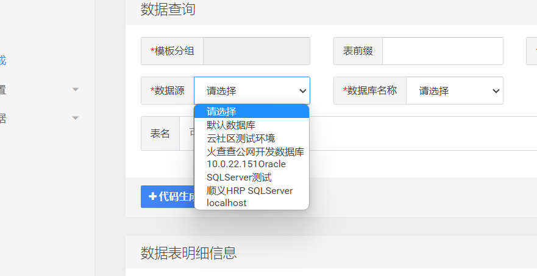
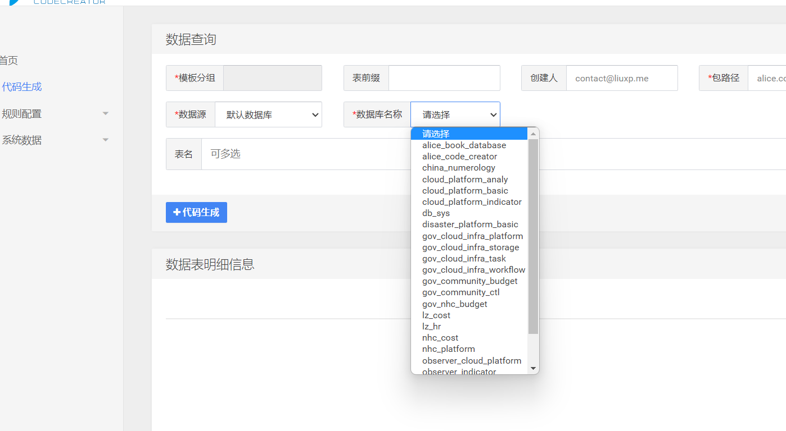
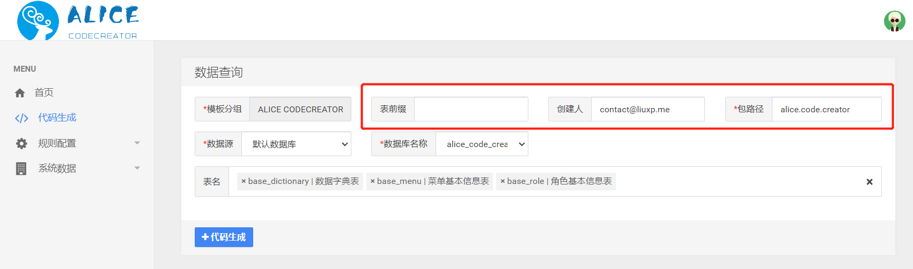

# 生成代码
---

[TOC]

## 开始生成代码

打开菜单中的“代码生成”页面，如下图所示：

### 选择数据源

选择配置好的数据源，您可以在下拉列表中看到您自己配置的数据源和系统自带的默认数据库，如下图所示：

这里，我们假设数据源选择默认数据库。

### 选择数据库

选择了数据源之后，在数据库下拉列表中会显示该数据源中所有可用数据库，如下图所示：

这里，我们假设数据库选择alice_code_creator。

### 选择表

选择了数据库之后，在数据表名称下拉列表中会显示该数据库中所有可用表，支持多选，如下图所示：

这里，我们假设选择数据表base_dictionary、base_menu、base_role三张表，如下图所示：

可以看到，系统自动读取出表的描述信息和所有字段。

## 选择模板分组

点击模板分组，弹出模板分组选择页面，如下图所示：

这里，我们假设选择`ALICE CODECREATOR`分组，如下图所示：

可以看出，根据选择的分组会自动带出表前缀、创建人和包路径，也可以视情况修改。

## 生成

点击“代码生成”按钮，后台会根据上述全部信息和配置参数进行代码生成工作，并弹出下载窗口，如下图所示：

可以看到生成的文件是表名+时间戳的zip压缩包。

## 解压缩查看
我们解压缩生成好的压缩包，并用开发工具打开，如下图所示：

可以看到根据我配置的模板生成了全套代码，从html、js页面到Java类、再到xml数据库查询SQL文件，均按路径生成完毕。