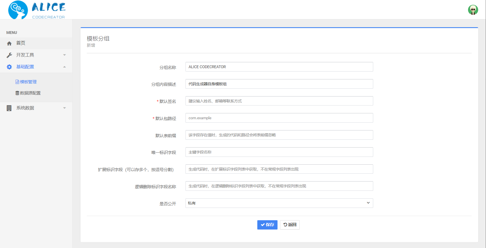
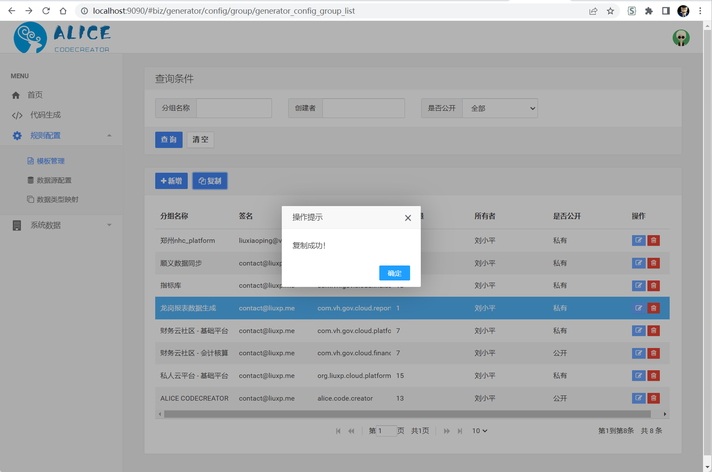
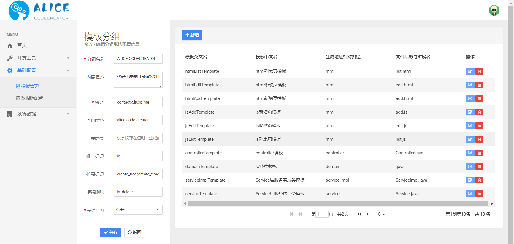
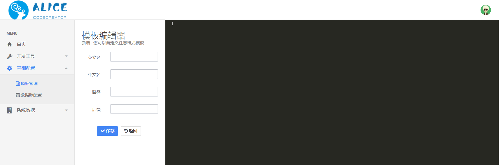

# 模板配置
---

[TOC]

## 模板管理

> 当我们想要通过数据库表结构来生成代码时，我们通常会生成多个文件，比如前台的html和js文件，后台的java类和mapper等等，会同时产生多个不同类型的文件。
> 那么我们认为一个文件就对应一个模板，这里就引入了组的概念，即一个模板分组是多个模板的集合。

### 模板分组列表

打开菜单“规则配置”中的“模板管理”页面，如下图所示：


### 新增模板分组

点击“+新增”按钮，创建模板分组，如下图所示：



输入模板基本信息字段：

* 分组名称：分组名称，好记即可。
* 分组内容描述：详细描述模板分组的作用，可以为空。
* 默认签名：建议输入姓名、邮箱等联系方式，不可为空。
* 默认包路径：工程包路径，不可为空。
* 默认表前缀：该字段存在值时，生成的代码和路径会将表前缀忽略，可以为空。
* 唯一标识字段：主键字段名称，只能配置一个，可以为空。
* 扩展标识字段：生成代码时，在扩展标识字段列表中获取，不在常规字段列表出现，可以存多个，按逗号分割，可以为空。
* 逻辑删除标识字段：生成代码时，在逻辑删除标识字段列表中获取，不在常规字段列表出现，只能配置一个，可以为空。
* 是否公开：其他人是否可以看到你的模板并使用。

### 复制模板分组

支持从旧有分组复制出新的分组，简化配置的工作量，如图所示：

复制后的分组名称默认命名为`原名称的拷贝`

### 配置模板

点击操作列中的“修改”按钮，进入模板配置页面，如下图所示：



页面左侧可以看到刚刚创建时填写的字段信息，右侧是这个分组中的模板，目前没有任何模板存在。

那么我们点击“新增”按钮创建一个模板文件，如下图所示：



左侧有4个字段需要我们填写，右侧整个黑色区域是填写具体模板代码的位置。

* 英文名：文件的英文编码，可以自定义，暂无实际意义。
* 中文名：文件的中文名称，可以自定义，暂无实际意义。
* 路径：生成文件保存的位置，按照“.”分割多个层级。
* 后缀：生成文件的文件名后半部分，格式化后的表名称+后缀是整个文件的文件名。

模板的实际编写方式，可以参照系统自带的`ALICE CODECREATOR`分组，配合[模板的语法](Template.md#_6)和[模板可用参数](Template.md#_10)两章文档编写。


## 模板的语法

当前模板使用的是Velocity的语法结构，我将简单介绍一些常见写法，完全文档可以参考[Velocity官方文档](https://velocity.apache.org/engine/devel/user-guide.html)。

### 变量

使用$取出在VelocityContext容器中存放的值。
```
$!{tablePrefix}
$!{tableNameEN}

#foreach(${column} in ${columns})
    $!{column.columnNameCH}
#end
```
需要注意，上面代码中 $!{}的写法，使用$var获取变量时，如果变量不存在，Velocity引擎会将其原样输出，通过使用$!{}的形式可以将不存在的变量变成空白输出。
### 条件控制

在Velocity中可以使用条件语法对流程进行控制
```
#if($!{column.javaType}  == "Date")
    ...
#elseif($!{column.javaType}=="String" and $!{column.likeFlag} == true)
    ...
#else
```
### 循环

在Velocity中可以使用循环语法遍历集合，语法结构如下：

```
#foreach($item in $list)
 $item
 $velocityCount 
#end
```
其中，$item代表遍历的每一项，velocityCount是Velocity提供的用来记录当前循环次数的计数器，默认从1开始计数。

## 模板可用参数

| 参数 | 类型 | 注释 |
| ------ | ------ | ------ |
| tablePrefix | `java.lang.String` | 表名前缀（带下划线），如果不去掉前缀则为空 |
| htmlPath | `java.lang.String` | 前台页面路径 |
| htmlFileName | `java.lang.String` | 前台页面名称 |
| packagePath | `java.lang.String` | 包路径 |
| tableNameCH | `java.lang.String` | 中文表名 |
| tableNameEN | `java.lang.String` | 英文表名 |
| tableNameENUpperCase | `java.lang.String` | 英文表名（大写） |
| tablePrefixLowerCase | `java.lang.String` | 表名前缀（小写） |
| tablePrefixUpperCase | `java.lang.String` | 表名前缀（大写） |
| tableClassNameEN | `java.lang.String` |  |
| tablePropertyNameEN | `java.lang.String` |  |
| author | `java.lang.String` | 创建者 |
| dateTime | `java.lang.String` | 创建日期 |
| pkColumn | `Column` | 主键字段 |
| extFlagColumns | `java.util.List<Column>` | 扩展标识字段 |
| effectiveFlagColumn | `Column` | 逻辑删除标识字段 |
| columns | `java.util.List<Column>` | 普通字段 |

### 自定义类型

你会注意到，在模板可用参数中，除了Java基本类型外，存在一个`Column`类型，这是一个自定义实体类，它的详细字段如下：

#### Column类型解析

| 名称 | 类型 | 注释 |
| ------ | ------ | ------ |
| columnNameCH | `java.lang.String` | 字段中文名称 |
| columnNameEN | `java.lang.String` | 字段英文名称 |
| columnPropertyName | `java.lang.String` | 字段属性名称 |
| columnMethodName | `java.lang.String` | 字段方法名称 |
| jdbcType | `java.lang.String` | Jdbc数据类型 |
| javaType | `java.lang.String` | Java数据类型 |
| autoFill | `java.lang.String` | 自动填充 |
| likeFlag | `java.lang.String` | 模糊标识 |
| isNullable | `java.lang.Boolean` | 是否可以为空 |
| maxLength | `java.lang.String` | 字段长度 |